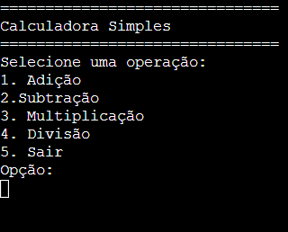
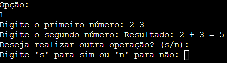
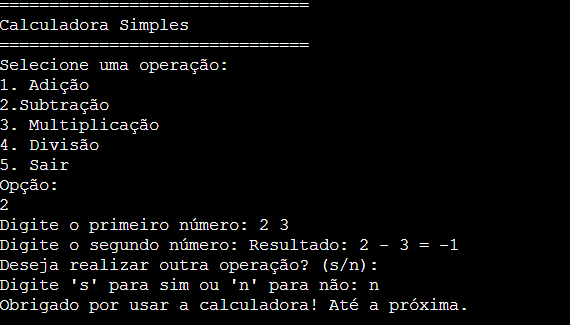

# NepsCalculator
### A simple calculator written in C for a NepsAcademy project

## Features
1. Addition (+)
2. Subtraction (-)
3. Multiplication (*)
4. Division (/)

## Usage
The program provides basic calculator operations. After running the program, input the desired operation and the two numbers to perform the calculation.
### Example of Addition: 
```
Opção: 1
Digite o primeiro número: 2
Digite o segundo número: 3
Resultado: 2 + 3 = 5
```

## Demostration
 -> Home Screen

 -> Operation Example

 -> Turn Off example

## Requirements
1. C Compiler (GCC recommended)
2. Operating system: Windows, macOS or Linux

## Installation
### 1. Clone the repository
First, clone the repository to your local machine:

```bash
git clone https://github.com/DKuhn29/NepsCalculator 
cd NepsCalculator
```
### 2. Copile the code
To compile the program, use a C compiler. If you don't have a C compiler installed, here are some examples based on your operating system.
1. Windows: Download and install MinCW, which includes GCC
2. macOS: it is typically pre-installed. 

## Structure
```
    NEPSCALCULATOR/  
    │── Images/                   # Directory for screenshots
    │   │── image-1.png           # Example screenshot 1
    │   ├── image-2.png           # Example screenshot 2
    │   ├── image.png             # Example screenshot 2
    │── calculator.c              # Main C program file
    │── LICENSE                   # License file
    │── README.md                 # Project documentation
```

## License
This project is licensed under the MIT License - see the [LICENSE](LICENSE) file for more details.